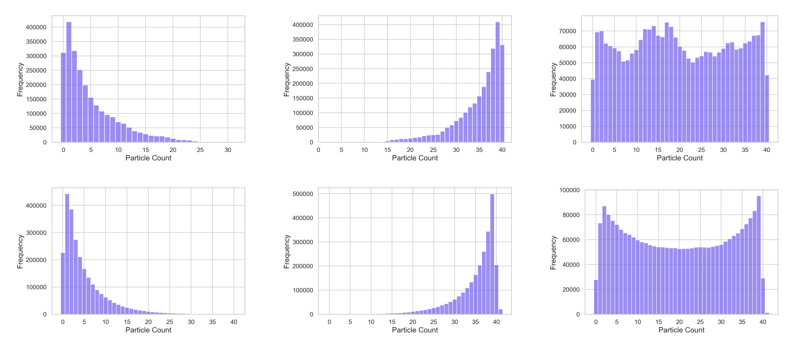

# Random walks on graphs
The aim of this work is to explore the behavior of movement of particles in a simple network. The network is 2-regular graph, linear disposition of nodes with periodic boundary conditions, a structure equivalent to a ring. The particles perform a random walk across nodes: through the edges a particle can travel among the linked nodes.<br/> 
In this network, the random walk behavior represents an equal probability for a particle to move either to its left or right neighboring node. 
This random walk can be simulated in two different types of dynamics: one-step or synchronous. In the one-step approximation, the evolution is the one-step master equation: <br /> 

<p align="center">

</p>

and the information is instaneously updated after a single node performs movement.
The synchronous dynamics is less explored and it is not trivial to write a ME. In this setting, the network state is updated only after all the nodes have performed their movement. 
To model congestion effects, storage capacity is to be constrained meaning that only a finite number of particles can stack on the same node at the same time.
The stationary distributions depends solely on the relation between the initial number of particles and the maximal occupancy. Three distinct distributions are identified based on different initial occupancies: occupancy close to $0$, close to the capacity, and half the capacity. 
For the one-step process, it can be shown that the three solutions can be derived from the maximum entropy principle.


The code initializes the network with given parameters and performs a random walk based on the type of chosen dynamics. For each timestep, it cycles through the nodes. For each node, one particle randomly choose a neighbor and jump to it if its occupancy is less than the maximal one. Depending on the dynamics, after every movement or after every node has performed a movement, the network is updated and the state (occupancy) for each node are stored. What we get is a histogram that represent the most likely states through the simulation.
## Structure
- The file [random_walk](https://github.com/daliamanfrin/Random-walks-on-graphs/blob/main/random_walk.py) contains the definition of all the functions, from the initialization of the network to the definition of the random walk. Functions include the choice of the neighbor based on the random direction and the definition of a function for performing the jumps for a single node (`move_particle`). Finally the two functions for the types of dynamics, which both use `move_particle`.

- The tests folder contains the [testing](https://github.com/daliamanfrin/Random-walks-on-graphs/blob/main/tests/testing.py) file tests the functions in the previous file, to ensure correct behavior; and the [configuration_tests](https://github.com/daliamanfrin/Random-walks-on-graphs/blob/main/tests/configuration_test.txt) file to have a configuration specific to testing.

- The [configuration](https://github.com/daliamanfrin/Random-walks-on-graphs/blob/main/configuration.txt) file contains the definitions of the parameters used in the simulation: number of nodes (`N`), initial number of particle per node (`M`), number of timesteps of the simulation (`time_steps`), maximal occupancy (`n_max`). The type of dynamics is to be chosen between `one_step` and `synchronous`. Lastly the paths can be set up to save results data and plots. 

- The file [simulation](https://github.com/daliamanfrin/Random-walks-on-graphs/blob/main/simulation.py) contains the main part of the code. The ConfigParser library is used in order to import the configuration file from command line, and passing its parameters to the program. For every iteration or timestep, random walk is performed for the occupants of the nodes, based on the chosen type of dynamic. The state of each node (the number of particles it contains) is computed and saved, path to save be decided in configuration.txt. 

- The file [plots](https://github.com/daliamanfrin/Random-walks-on-graphs/blob/main/plot.py) contains the function that plots the counts of the states of nodes through the iterations. It uses the data generated during the simulation and saved. The paths to save the plot can be decided in configuration.txt. 


## Installation
To install the application, clone this repository and add the requirements.
```
git clone https://github.com/daliamanfrin/Random-walks-on-graphs
cd Random-walks-on-graphs
pip install -r requirements.txt
```


## Usage
To use the program:
1. Choose desired configuration in the configuration file. Edit the existent one or create a new one following the same template, choosing parameters values, dynamics type and paths for saving intermediate results and plots.<br/> 
N.B the first 1000 timesteps are used to stabilize the network, use `time_steps` $> 1000$.
2. Run the simulation file with first argument the configuration file, for example: 
```
python simulation.py configuration.txt
```
&nbsp;&nbsp;&nbsp;&nbsp;&nbsp; &nbsp; This produces and saves a file (default is **particle_counts.npy**) with stored particle counts.
 
3. To visualize the distributions plot, run the plotting file using the produced data. Syntax is, like before 
```
python plot.py configuration.txt
```
 &nbsp;&nbsp;&nbsp;&nbsp;&nbsp; &nbsp; Here data is loaded from path and the plot is saved (default: in images folder).

### Example
Images show distributions for one-step process (top) and synchronous dynamics (bottom) for a almost empty, almost congested and half-filled networks.
Note that in the synchronous dynamics the theoretical maximal occupancy can be surpassed.
The example is reproducible using:<br/> 
```
N = 50
M = 5/20/35
n_max = 40
time_steps = 2000
collection_time = 1000
seed_value = 5
```


